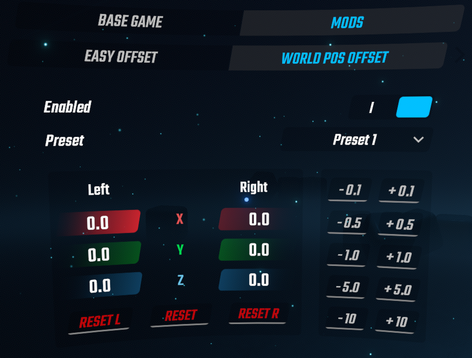

# World Pos Offset

通过这个Mod，你可以分别调整左右光剑的世界位置偏移。（可以和 [Easy Offset](https://github.com/Reezonate/EasyOffset) 一起使用）

这或许是手感调优的最后一块拼图，我自己用上这个功能后，发力更加自然了，剑轨更加符合预期了，连肩膀的酸痛都减轻了！

1.29.1 及之前的版本可以使用 [Saber Tailor](https://github.com/Shadnix-was-taken/BeatSaber-SaberTailor) 来达到相同的目的。

With this mod, you can independently adjust the world position offsets of the left and right sabers. (Can be used alongside [Easy Offset](https://github.com/Reezonate/EasyOffset))

This might be the final piece for optimizing swinging experience. With this feature, my swings feel more natural, the saber trajectories better match my expectations, and even my shoulder pain has lessened!

Game versions 1.29.1 and earlier can achieve the same feature using [Saber Tailor](https://github.com/Shadnix-was-taken/BeatSaber-SaberTailor).

# 用途 - Usage

- 减轻/消除生理性的左右差异，使两侧手感更加一致
- 削减/扩展肩宽，使发力更加自然
- 把剑向前移动一段距离，达到类似第三人称游玩的效果，可以用来观察自己的挥动轨迹，或者单纯调着玩
- 修正手柄软硬件问题导致的世界空间定位偏移

- Reduce/eliminate physiological left-right discrepancies for more consistent swinging experience on both sides.
- Narrow/expand shoulder width to enable more natural swing mechanics.
- Move sabers forward to simulate third-person perspective, can be used to observe the saber trajectories or just for fun.
- Correct world space position shifting of controllers caused by hardware/software issues.

# 参考 - Reference

- [Saber Tailor](https://github.com/Shadnix-was-taken/BeatSaber-SaberTailor)
- [Easy Offset](https://github.com/Reezonate/EasyOffset)
- [JD Fixer](https://github.com/zeph-yr/JDFixer)